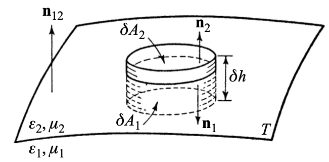
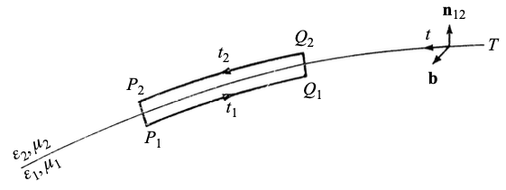

This note introduces basic properties of the electromagnetic field.

# Maxwell's Equations

The effect of fields on material objects:
$$
\begin{aligned}
\nabla \times \mathbf{H}
    - \frac{1}{c}\frac{\partial \mathbf{D}}{\partial t}
    &= \frac{4\pi}{c}\mathbf{j},\\
\nabla \times \mathbf{E}
    + \frac{1}{c}\frac{\partial \mathbf{B}}{\partial t}
    &= \mathbf{0},
\end{aligned}
$$ {#eq-maxwell-curl}
Here, $\mathbf{H}$ is the **_magnetic vector_**, $\mathbf{D}$ is the **_electric displacement_**, and $\mathbf{j}$ is the **_current density_**.

They are supplemented by two scalar relations:
$$
\begin{aligned}
\nabla \cdot \mathbf{D} &= 4\pi\rho,\\
\nabla \cdot \mathbf{B} &= 0.
\end{aligned}
$$ {#eq-gauss-maxwell}
The first equation relates the electric displacement to the charge density, while the second implies that no free magnetic poles exist.

From @eq-maxwell-curl it follows that
$$
\begin{aligned}
\nabla \cdot (\nabla \times \mathbf{H}) 
    - \nabla \cdot (\frac{1}{c}\frac{\partial \mathbf{D}}{\partial t}) 
    &= \nabla \cdot (\frac{4\pi}{c}\mathbf{j})
\\
- \frac{1}{4 \pi} \nabla \cdot \frac{\partial \mathbf{D}}{\partial t} =\nabla \cdot \mathbf{j}
\end{aligned}
$$
using @eq-gauss-maxwell,
$$
\frac{\partial \rho}{\partial t} + \nabla \cdot \mathbf{j} = 0,
$$ {#eq-continuity}
The continuity equation is analogous to the equation encountered in hydrodynamics. It expresses the fact that charge is conserved in the neighbourhood of any point. Indeed, if one integrates @eq-continuity over any region of space, one obtains, with the help of Gauss's theorem,
$$
\frac{d}{dt} \int \rho dV + \int \mathbf{j} \cdot \mathbf{n} dS = 0,
$$
<!-- the second integral being taken over the surface bounding the region and the first throughout the volume, $\mathbf{n}$ denoting the unit outward normal.  -->
This equation implies that the total charge:
$$
e = \int \rho dV
$$ {#eq-total-charge}

In optical fields, the field vectors vary rapidly with time. The word **_stationary_** is often used in a wider sense.
$$
\begin{array}{c|c|c}
\textbf{Field type}
&
\textbf{Time dependence}
&
\textbf{Current density}
\\[4pt]
\hline
\text{Static field}
&
\displaystyle \frac{\partial \mathbf{E}}{\partial t}=\frac{\partial \mathbf{D}}{\partial t}=\frac{\partial \mathbf{B}}{\partial t}=\frac{\partial \mathbf{H}}{\partial t}=\mathbf{0}
&
\mathbf{j}=\mathbf{0}
\\[10pt]
\text{Stationary field}
&
\displaystyle \frac{\partial \mathbf{E}}{\partial t}=\frac{\partial \mathbf{D}}{\partial t}=\frac{\partial \mathbf{B}}{\partial t}=\frac{\partial \mathbf{H}}{\partial t}=\mathbf{0}
&
\mathbf{j}\neq\mathbf{0}
\end{array}
$$

# Material equations

If the bodies are at rest or move very slowly relative to one another, and if the material is **_isotropic_**, the material equations usually take the following relatively simple form:
$$
\begin{aligned}
\mathbf{j} &= \sigma \mathbf{E},
\\
\mathbf{D} &= \epsilon \mathbf{E},
\\
\mathbf{B} &= \mu \mathbf{H}.
\end{aligned}
$$ {#eq-material-equations}
Here $\sigma$ is called the **_specific conductivity_**, $\epsilon$ is known as the **_dielectric constant_** (or permittivity), and $\mu$ is called the **_magnetic permeability_**.

# Boundary conditions at a surface of discontinuity

## Magnetic Induction and Electric Displacement

{width=50%}

<!-- Since $\mathbf{B}$ and its derivatives may be assumed to be continuous throughout the cylinder, we can apply Gauss' theorem to the integral of $\nabla \cdot \mathbf{B}$ taken throughout the volume of the cylinder and obtain from -->
$$
\int \nabla \cdot \mathbf{B} dV = \int \mathbf{B} \cdot \mathbf{n} dS = 0
$$ {#eq-gauss-magnetic-induction}
Since the areas $\delta A_1$ and $\delta A_2$ are assumed to be small, $\mathbf{B}$ may be considered to have constant values $\mathbf{B}^{(1)}$ and $\mathbf{B}^{(2)}$ on $\delta A_1$ and $\delta A_2$, and $(12)$ may then be replaced by
$$
\mathbf{B}^{(1)} \cdot \mathbf{n}_1 \delta A_1 + \mathbf{B}^{(2)} \cdot \mathbf{n}_2 \delta A_2 + \text{contribution from walls} = 0
$$
When the cylinder shrinks to zero,
$$
(\mathbf{B}^{(1)} \cdot \mathbf{n}_1 + \mathbf{B}^{(2)} \cdot \mathbf{n}_2) \delta A = 0
$$
$$
\mathbf{n}_{12} \cdot (\mathbf{B}^{(2)} - \mathbf{B}^{(1)}) = 0
$$ {#eq-magnetic-induction-continuous}
The normal component of the **_magnetic induction_** is **continuous** across the boundary.

From @eq-gauss-maxwell, we have the **_electric displacement_** $\mathbf{D}$:
$$
\int \nabla \cdot \mathbf{D} dV = \int \mathbf{D} \cdot \mathbf{n} dS = 4\pi \int \rho dV
$$ {#eq-gauss-electric-displacement}
When the contribution from the walls tends to zero, the derivation is identical to that of @eq-magnetic-induction-continuous.
$$
\mathbf{n}_{12} \cdot (\mathbf{D}^{(2)} - \mathbf{D}^{(1)}) = 4 \pi \hat{\rho}
$$ {#eq-electric-displacement-discontinuous}
The normal component of the **_electric displacement_** is **discontinuous** across the boundary.

## Surface Density

As $\delta A_1$ and $\delta A_2$ shrink together, the total charge remains finite, so that the volume density becomes infinite. Instead of the volume charge density $\rho$, the concept of **_surface charge density_** $\hat{\rho}$ must be used.
$$
\lim_{\delta h \to 0} \int \rho dV = \int \hat{\rho} dA
$$ {#eq-surface-charge-density}
The **_surface current density_** $\hat{\mathbf{j}}$ is defined in a similar way:
$$
\lim_{\delta h \to 0} \int \mathbf{j} dV = \int \hat{\mathbf{j}} dA
$$ {#eq-surface-current-density}

## Electric Vector and Magnetic Vector

{#fig-boundary-conditions width=50%}

$\mathbf{b}$ is the unit vector perpendicular to the plane of the rectangle. It follows from @eq-maxwell-curl and from Stokes' theorem that
$$
\int (\nabla \times \mathbf{E}) \cdot \mathbf{b} dS = \int \mathbf{E} \cdot d \mathbf{r} = - \frac{1}{c} \int \frac{\partial \mathbf{B}}{\partial t} \cdot \mathbf{b} dS
$$
If the lengths $P_1 Q_1 = \delta s_1$ and $P_2 Q_2 = \delta s_2$ are small:
$$
\mathbf{E}^{(1)} \cdot \mathbf{t}_1 \delta s_1 + \mathbf{E}^{(2)} \cdot \mathbf{t}_2 \delta s_2 + \text{contribution from ends} = -\frac{1}{c} \frac{\partial \mathbf{B}}{\partial t} \cdot \mathbf{b} \delta s \delta h
$$
where $\delta s$ is the line element along which the rectangle intersects the surface.
$$
(\mathbf{E}^{(1)} \cdot \mathbf{t}_1 + \mathbf{E}^{(2)} \cdot \mathbf{t}_2) \delta s = 0
$$
$$
\mathbf{b} \cdot [\mathbf{n}_{12} \times (\mathbf{E}^{(2)} - \mathbf{E}^{(1)})] = 0
$$
$$
\mathbf{n}_{12} \times (\mathbf{E}^{(2)} - \mathbf{E}^{(1)}) = 0
$$ {#eq-electric-vector-continuous}
The tangential component of the **_electric vector_** is **continuous** across the boundary.

Consider the behaviour of the tangential component of the magnetic vector. The analysis is similar, but there is an additional term if currents are present.
$$
\mathbf{H}^{(1)} \cdot \mathbf{t}_1 \delta s_1 + \mathbf{H}^{(2)} \cdot \mathbf{t}_2 \delta s_2 + \text{contribution from ends} = \frac{1}{c} \frac{\partial \mathbf{D}}{\partial t} \cdot \mathbf{b} \delta s \delta h + \frac{4 \pi}{c} \hat{\mathbf{j}} \cdot \mathbf{b} \delta s
$$
When $\delta h \to 0$, the derivation is identical to that of @eq-electric-vector-continuous.
$$
\mathbf{n}_{12} \times (\mathbf{H}^{(2)} - \mathbf{H}^{(1)}) = \frac{4 \pi}{c} \hat{\mathbf{j}}
$$ {#eq-magnetic-vector-discontinuous}
The tangential component of the **_magnetic vector_** is **discontinuous** across the boundary.

# The energy law of the electromagnetic field

From @eq-maxwell-curl it follows that
$$
\mathbf{E} \cdot (\nabla \times \mathbf{H}) - \mathbf{H} \cdot (\nabla \times \mathbf{E}) = \frac{4 \pi}{c} \mathbf{j} \cdot \mathbf{E} + \frac{1}{c} \mathbf{E} \cdot \frac{\partial \mathbf{D}}{\partial t} + \frac{1}{c} \mathbf{H} \cdot \frac{\partial \mathbf{B}}{\partial t}
$$
From
$$
\begin{aligned}
\\
\nabla \cdot (\mathbf A \times \mathbf B) &= \epsilon_{ijk} \partial_k (A_i B_j) \\
&= \epsilon_{ijk} [(\partial_k A_i) B_j + A_i (\partial_k B_j)] \\
&= B_j (\epsilon_{ijk} \partial_k A_i) + A_i (\epsilon_{ijk} \partial_k B_j) \\
&= B_j (\epsilon_{kij} \partial_k A_i) + A_i (-\epsilon_{kji} \partial_k B_j) \\
&= \mathbf{B} \cdot (\nabla \times \mathbf{A}) - \mathbf{A} \cdot (\nabla \times \mathbf{B})
\end{aligned}
$$
We have that
$$
\mathbf{E} \cdot (\nabla \times \mathbf{H}) - \mathbf{H} \cdot (\nabla \times \mathbf{E}) = - \nabla \cdot (\mathbf{E} \times \mathbf{H})
$$
$$
\frac{1}{c} (\mathbf{E} \cdot \frac{\partial \mathbf{D}}{\partial t} + \mathbf{H} \cdot \frac{\partial \mathbf{B}}{\partial t}) + \frac{4 \pi}{c} \mathbf{j} \cdot \mathbf{E} + \nabla \cdot (\mathbf{E} \times \mathbf{H}) = 0
$$
Integrating over an arbitrary volume and applying Gauss's theorem, we obtain
$$
\frac{1}{4 \pi} \int (\mathbf{E} \cdot \frac{\partial \mathbf{D}}{\partial t} + \mathbf{H} \cdot \frac{\partial \mathbf{B}}{\partial t}) dV + \int \mathbf{j} \cdot \mathbf{E} dV + \frac{c}{4 \pi} \int (\mathbf{E} \times \mathbf{H}) \cdot \mathbf{n} dS = 0
$$ {#eq-energy-law}

On using the material equations @eq-material-equations, we have
$$
\left.
\begin{aligned}
\frac{1}{4 \pi}
(\mathbf{E} \cdot \frac{\partial \mathbf{D}}{\partial t})
&= \frac{1}{4 \pi}
\mathbf{E} \cdot \frac{\partial}{\partial t}(\epsilon \mathbf{E})
= \frac{1}{8 \pi}
\frac{\partial}{\partial t}(\epsilon \mathbf{E}^2)
= \frac{1}{8 \pi}
\frac{\partial}{\partial t}(\mathbf{E} \cdot \mathbf{D})
\\
\frac{1}{4 \pi}
(\mathbf{H} \cdot \frac{\partial \mathbf{H}}{\partial t})
&= \frac{1}{4 \pi}
\mathbf{H} \cdot \frac{\partial}{\partial t}(\mu \mathbf{H})
= \frac{1}{8 \pi}
\frac{\partial}{\partial t}(\mu \mathbf{H}^2)
= \frac{1}{8 \pi}
\frac{\partial}{\partial t}(\mathbf{H} \cdot \mathbf{B})
\end{aligned}
\right\}
$$
Setting
$$
w_e = \frac{1}{8 \pi} \mathbf{E} \cdot \mathbf{D},\qquad w_m = \frac{1}{8 \pi} \mathbf{H} \cdot \mathbf{B}
$$ {#eq-energy-density}
and
$$
W=\int (w_e + w_m) dV
$$ {#eq-total-energy}
@eq-energy-law becomes
$$
\frac{d W}{d t} + \int \mathbf{j} \cdot \mathbf{E} dV + \frac{c}{4 \pi} \int (\mathbf{E} \times \mathbf{H}) \cdot \mathbf{n} dS = 0
$$ {#eq-w-energy-law}
$W$ represents the total energy contained within the volume, $w_e$ may be identified with the **_electric energy density_** and $w_m$ with the **_magnetic energy density_** of the field.

To justify the interpretation of $W$ as the total energy we can assume the material bodies to be so small that they can be regarded as point charges $e_k (k = 1, 2, \dots)$. 
The force exerted by a field $(\mathbf{E}, \mathbf{B})$ on a charge $e$ moving with velocity $\mathbf{v}$ is given by the so-called **_Lorentz law_**
$$
\mathbf{F} = e(\mathbf{E} + \frac{1}{c} \mathbf{v} \times \mathbf{B})
$$
It follows that if all the charges $e_k$ are displaced by $\delta \mathbf{x}_k$ ($k = 1, 2, \dots$) during a time interval $\delta t$, the total work done is
$$
\begin{aligned}
\delta A 
&= \sum_k \mathbf{F}_k \cdot \delta \mathbf{x}_k 
= \sum_k e_k(\mathbf{E}_k + \frac{1}{c}\mathbf{v}_k \times \mathbf{B}) \cdot \mathbf{v}_k \delta t\\
&= \sum_k e_k \mathbf{E}_k \cdot \mathbf{v}_k \delta t +
\sum_k(\frac{1}{c}\mathbf{v}_k \times \mathbf{B}) \cdot \mathbf{v}_k \delta t
= \sum_k e_k \mathbf{E}_k \cdot \mathbf{v}_k \delta t
\end{aligned}
$$
$$
(\frac{1}{c}\mathbf{v}_k \times \mathbf{B}) \cdot \delta \mathbf{x}_k = (\frac{1}{c}\mathbf{v}_k \times \mathbf{B}) \cdot \mathbf{v}_k \delta t
$$
If the number of charged particles is large, we can consider the distribution to be continuous. We introduce the charge density $\rho$:
$$
\delta A = \delta t \int \rho \mathbf{v} \cdot \mathbf{E} dV
$$
The current density $\mathbf{j}$ appearing in Maxwell's equations can be split into two parts:
$$
\mathbf{j} = \mathbf{j}_c + \mathbf{j}_\nu
$$
where
$$
\begin{aligned}
\mathbf{j}_c &= \sigma \mathbf{E}
\\
\mathbf{j}_\nu &= \rho \mathbf{v}
\end{aligned}
$$
Using @eq-w-energy-law,
$$
\begin{aligned}
\frac{d W}{d t} 
+ \int \mathbf{j} \cdot \mathbf{E} dV 
&+ \frac{c}{4 \pi} \int (\mathbf{E} \times \mathbf{H}) \cdot \mathbf{n} dS = 0
\\
\frac{d W}{d t} 
+ \int \mathbf{j}_c \cdot \mathbf{E} dV + \int \mathbf{j}_\nu \cdot \mathbf{E} dV 
&+ \frac{c}{4 \pi} \int (\mathbf{E} \times \mathbf{H}) \cdot \mathbf{n} dS = 0
\\
\frac{d W}{d t} 
+ \int \sigma \mathbf{E}^2 dV + \int \rho \mathbf{v} \cdot \mathbf{E} dV 
&+ \frac{c}{4 \pi} \int (\mathbf{E} \times \mathbf{H}) \cdot \mathbf{n} dS = 0
\\
\frac{d W}{d t} 
+ Q + \frac{\delta A}{\delta t}
&+ \int \mathbf{S} \cdot \mathbf{n} dS = 0
\end{aligned}
$$
$$
\frac{d W}{d t} =
- \frac{\delta A}{\delta t}
- Q
- \int \mathbf{S} \cdot \mathbf{n} dS
$$ {#eq-poynting-vector}
where the term $Q$ represents Joule heating, and the vector $\mathbf{S}$ is the Poynting vector.

In a nonconducting medium ($\sigma = 0$) where no mechanical work is done ($A = 0$), the energy equation becomes:
$$
\frac{\partial w}{\partial t} + \nabla \cdot \mathbf{S} = 0
$$
