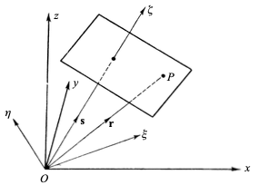

We briefly examine the simplest solution of this equation.
$$
\nabla^2 V - \frac{1}{v^2}\frac{\partial^2 V}{\partial t^2} = 0
$$

# Plane waves

A plane wave is a wave whose amplitude is constant on every plane perpendicular to a fixed propagation direction. The field can therefore change as we move along the direction of propagation, but it has the same value at all points on one such plane.

{#fig-boundary-conditions width=50%}

Let $\mathbf{s}$ be a unit vector in the fixed propagation direction, and let $\mathbf{r}$ be the position vector of a point $P$. The scalar $\mathbf{r}\cdot\mathbf{s}$ measures the position of $P$ along $\mathbf{s}$. We denote this coordinate by $\xi$.

$$
V = V(\mathbf{r} \cdot \mathbf{s}, t)
$$

This form expresses the defining property of a plane wave: the field depends on position only through $\xi$, rather than on the three Cartesian coordinates independently. Consequently, all points satisfying $\mathbf{r}\cdot\mathbf{s}=\xi$ have the same value of $V$ at a fixed time. These points form a plane whose normal is $\mathbf{s}$.

$$
\mathbf{r} \cdot \mathbf{s} = \xi
$$
$$
\mathbf{r} = (x,y,z) \qquad \mathbf{s} = (s_x,s_y,s_z)
$$
$$
\xi = xs_x + ys_y + zs_z
$$
Because $V$ depends on $x$, $y$, and $z$ only through the single variable $\xi$, its Cartesian derivatives can be found by the chain rule. For example, changing $x$ changes $\xi$ at the rate $s_x$, which gives

$$
\begin{aligned}
\frac{\partial V}{\partial x} &= \frac{\partial V}{\partial \xi} \frac{\partial \xi}{\partial x} \\
&= \frac{\partial V}{\partial \xi} \frac{\partial (xs_x + ys_y + zs_z)}{\partial x} \\
&= s_x \frac{\partial V}{\partial \xi}
\end{aligned}
$$
$$
\frac{\partial}{\partial x} = s_x \frac{\partial}{\partial \xi}, \quad
\frac{\partial}{\partial y} = s_y \frac{\partial}{\partial \xi}, \quad
\frac{\partial}{\partial z} = s_z \frac{\partial}{\partial \xi}
$$

Applying the same relation twice gives the second derivatives. Since $\mathbf{s}$ is a fixed vector, its components are constants and can be taken outside the derivatives.

$$
\frac{\partial^2 V}{\partial x^2}
=
\frac{\partial}{\partial x}
\left(
s_x\frac{\partial V}{\partial \xi}
\right)
=
s_x\frac{\partial}{\partial x}
\left(
\frac{\partial V}{\partial \xi}
\right)
=s_x^2 \frac{\partial^2 V}{\partial \xi^2}
$$
$$
\nabla^2V=(s_x^2+s_y^2+s_z^2) \frac{\partial^2 V}{\partial \xi^2}=\frac{\partial^2 V}{\partial \xi^2}
$$
The unit-vector condition $s_x^2+s_y^2+s_z^2=1$ is what reduces the three-dimensional Laplacian to a one-dimensional second derivative along the propagation direction. The wave equation therefore becomes

$$
\frac{\partial^2 V}{\partial \xi^2} - \frac{1}{v^2}\frac{\partial ^2 V}{\partial t^2} = 0
$$
To solve this one-dimensional equation, introduce the characteristic variables

$$
\xi - v t = p, \qquad \xi + v t = q
$$
The variables $p$ and $q$ move in opposite directions when time increases. They are useful because the wave equation separates naturally into a part depending only on $p$ and a part depending only on $q$.
$$
\begin{aligned}
\frac{\partial V}{\partial \xi} 
&= \frac{\partial V}{\partial p} \frac{\partial p}{\partial \xi}
+ \frac{\partial V}{\partial q} \frac{\partial q}{\partial \xi}\\
&= \frac{\partial V}{\partial p} 
+ \frac{\partial V}{\partial q}
\end{aligned}
$$
$$
\begin{aligned}
\frac{\partial^2 V}{\partial \xi^2} 
&= (\frac{\partial}{\partial p} + \frac{\partial}{\partial q})
(\frac{\partial V}{\partial p} + \frac{\partial V}{\partial q})\\
&= \frac{\partial^2 V}{\partial p^2} +2 \frac{\partial^2 V}{\partial p \partial q} +\frac{\partial^2 V}{\partial q^2}
\end{aligned}
$$
$$
\begin{aligned}
\frac{\partial V}{\partial t} 
&= \frac{\partial V}{\partial p} \frac{\partial p}{\partial t}
+ \frac{\partial V}{\partial q} \frac{\partial q}{\partial t}\\
&= -v \frac{\partial V}{\partial p} 
+ v \frac{\partial V}{\partial q}
\end{aligned}
$$
$$
\begin{aligned}
\frac{\partial^2 V}{\partial t^2} 
&= (-v\partial_p+v\partial_q)
(-v V_p+v V_q)\\
&= v^2 (\frac{\partial^2 V}{\partial p^2} -2 \frac{\partial^2 V}{\partial p \partial q} +\frac{\partial^2 V}{\partial q^2})
\end{aligned}
$$
Substituting these derivatives into the reduced wave equation, the terms involving only $p$ and only $q$ cancel, leaving

$$
\frac{\partial^2 V}{\partial p \partial q} = 0
$$
This condition says that the $p$-dependent and $q$-dependent parts are independent of one another. Integrating with respect to the two variables gives the general solution

$$
\begin{aligned}
V &= V_1(p) + V_2 (q)\\
&= V_1(\mathbf{r} \cdot \mathbf{s} - v t)
+ V_2(\mathbf{r} \cdot \mathbf{s} + v t)
\end{aligned}
$$
Here $V_1$ represents a disturbance propagated with velocity $v$ in the positive $\xi$ direction, while $V_2$ represents a disturbance propagated with the same speed in the negative $\xi$ direction. A plane wave travelling in only one direction is obtained by setting the other function to zero.

# Spherical waves

A spherical wave has spherical wavefronts centered on the source. Its amplitude is the same at every point on a sphere of radius $r$, so the field depends on position only through the distance from the source, rather than through the direction of $\mathbf{r}$. We consider the region $r>0$, away from the source itself.
$$
V=V(r,t)
$$
Here $r=|\mathbf{r}|=\sqrt{x^2+y^2+z^2}$. Since $r$ depends on all three Cartesian coordinates, the derivatives of $V$ can again be obtained with the chain rule.
$$
\frac{\partial}{\partial x}
= \frac{\partial}{\partial r} \frac{\partial r}{\partial x}
= \frac{x}{r}\frac{\partial}{\partial r}
$$
The factor $x/r$ is the directional derivative of the radial coordinate with respect to $x$. It is the $x$-component of the unit vector pointing away from the source.
$$
\begin{aligned}
\frac{\partial^2 V}{\partial x^2}
&=\frac{\partial}{\partial x}(\frac{x}{r}\frac{\partial V}{\partial r})
\\
&=\frac{r-x\frac{x}{r}}{r^2}\frac{\partial V}{\partial r} 
+ \frac{x^2}{r^2}\frac{\partial^2 V}{\partial r^2}
\\
&=\frac{r^2-x^2}{r^3}\frac{\partial V}{\partial r} 
+ \frac{x^2}{r^2}\frac{\partial^2 V}{\partial r^2}
\end{aligned}
$$
The corresponding expressions for the $y$ and $z$ derivatives are obtained by cyclic permutation of the coordinates. Adding the three second derivatives gives the Laplacian for a spherically symmetric field:
$$
\begin{aligned}
\nabla^2V
&=\frac{\partial^2 V}{\partial x^2}+\frac{\partial^2 V}{\partial y^2}+\frac{\partial^2 V}{\partial z^2}
\\
&=\frac{3r^2-x^2-y^2-z^2}{r^3}\frac{\partial V}{\partial r} 
+ \frac{x^2+y^2+z^2}{r^2}\frac{\partial^2 V}{\partial r^2}
\\
&=\frac{2}{r}\frac{\partial V}{\partial r} 
+ \frac{\partial^2 V}{\partial r^2}
\\
&=\frac{1}{r}(2\frac{\partial V}{\partial r}
+r\frac{\partial^2 V}{\partial r^2})
\end{aligned}
$$
The first term describes the change in the radial slope as the spherical surface expands, while the second term is the ordinary second derivative in the radial direction. The expression can be simplified by introducing the product $rV$.
$$
\frac{\partial}{\partial r}(rV)
= V + r \frac{\partial V}{\partial r}
$$
$$
\begin{aligned}
\frac{\partial^2}{\partial r^2}(rV)
&= \frac{\partial V}{\partial r} 
+ \frac{\partial V}{\partial r}
+ r\frac{\partial^2 V}{\partial r^2}
\\
&=2\frac{\partial V}{\partial r}
+ r\frac{\partial^2 V}{\partial r^2}
\end{aligned}
$$
$$
\nabla^2V = \frac{1}{r}\frac{\partial^2}{\partial r^2}(rV)
$$
Thus the three-dimensional Laplacian has been reduced to a one-dimensional second derivative of $rV$. Substituting this result into the scalar wave equation gives
$$
\frac{1}{r}\frac{\partial^2}{\partial r^2}(rV) -  \frac{1}{v^2}\frac{\partial^2 V}{\partial t^2} = 0
$$
Multiplying by $r$ and using the fact that $r$ is independent of time, the equation for $rV$ has exactly the same form as the one-dimensional plane-wave equation. We can therefore replace $\xi$ by $r$ and $V$ by $rV$ in the previous solution:
$$
V = \frac{V_1(r-vt)}{r} + \frac{V_2(r+vt)}{r}
$$
The first term is an outward-propagating spherical wave and the second is an inward-propagating one. The factor $1/r$ expresses the geometric spreading of the wave: as the radius increases, the same disturbance is distributed over a larger spherical surface, so its amplitude decreases.

# Harmonic waves. The phase velocity

## Harmonic waves

A fixed point $\mathbf{r}_0$ sees the wave disturbance as a function of time only:
$$
V(\mathbf{r}_0,t)=F(t)
$$
For a periodic disturbance, the simplest important case is the sinusoidal function
$$
F(t)=a\cos(\omega t+\delta)
$$ {#eq-harmonic}
The quantities introduced in this expression are collected below.

| Concept | Definition | Meaning |
|:--|:--|:--|
| **_Fixed-point disturbance_** | $V(\mathbf{r}_0,t)=F(t)$ | At a fixed position, the disturbance depends only on time. |
| **_Periodic disturbance_** | $F(t+T)=F(t)$ | The disturbance repeats after every period $T$. |
| **_Amplitude_** | $a>0$ | The maximum value of the disturbance. |
| **_Phase_** | $\omega t+\delta$ | The instantaneous position of the oscillation within one cycle. |
| **_Initial phase_** | $\delta$ | The phase at $t=0$. |
| **_Angular frequency_** | $\omega$ | The phase change per unit time, measured in radians per second. |
| **_Period_** | $T$ | The time required for one complete vibration. |
| **_Frequency_** | $\displaystyle \nu=\frac{\omega}{2\pi}=\frac{1}{T}$ | The number of complete vibrations per second. |
| **_Harmonic wave_** | $F(t)=a\cos(\omega t+\delta)$ | A wave whose time dependence is sinusoidal. |

For a plane wave travelling in the direction of the unit vector $\mathbf{s}$ with speed $v$, replace $t$ by the retarded time $t-\mathbf{r}\cdot\mathbf{s}/v$. This gives
$$
V(\mathbf{r},t)
=a\cos\left[\omega\left(t-\frac{\mathbf{r}\cdot\mathbf{s}}{v}\right)+\delta\right]
$$
The quantities describing its spatial variation are summarized in the following table.

| Concept | Definition | Meaning |
|:--|:--|:--|
| **_Plane harmonic wave_** | $\displaystyle V(\mathbf{r},t)=a\cos\left[\omega\left(t-\frac{\mathbf{r}\cdot\mathbf{s}}{v}\right)+\delta\right]$ | A harmonic wave travelling in the direction $\mathbf{s}$. |
| **_Wavelength_** | $\displaystyle \lambda=vT=\frac{2\pi v}{\omega}$ | The distance over which the phase changes by $2\pi$. |
| **_Refractive index_** | $\displaystyle n=\frac{c}{v}$ | The ratio of the speed of light in vacuum to its speed in the medium. |
| **_Reduced wavelength_** | $\displaystyle \lambda_0=cT=n\lambda$ | The wavelength of a wave with the same frequency in vacuum. |
| **_Wave number_** | $\displaystyle \kappa=\frac{1}{\lambda_0}=\frac{\nu}{c}$ | The number of wavelengths in vacuum per unit length. |
| **_Vacuum wave number_** | $\displaystyle k_0=2\pi\kappa=\frac{2\pi}{\lambda_0}=\frac{\omega}{c}$ | The phase change per unit length in vacuum. |
| **_Medium wave number_** | $\displaystyle k=nk_0=\frac{2\pi}{\lambda}=\frac{n\omega}{c}=\frac{\omega}{v}$ | The phase change per unit length in the medium. |
| **_Wave vectors_** | $\mathbf{k}=k\mathbf{s}$ and $\mathbf{k}_0=k_0\mathbf{s}$ | Vectors pointing in the propagation direction, with magnitudes $k$ and $k_0$. |
| **_Path length_** | $\displaystyle l=\frac{v}{\omega}\delta=\frac{\lambda}{2\pi}\delta=\frac{\lambda_0}{2\pi n}\delta$ | The distance equivalent to a phase difference $\delta$. |

## Complex amplitudes

A plane wave has constant amplitude on each wavefront. More generally, a real **_time-harmonic wave_** can have both amplitude and phase varying with position:
$$
V(\mathbf{r},t)=a(\mathbf{r})\cos[\omega t-g(\mathbf{r})]
$$
Here $a(\mathbf{r})>0$ and $g(\mathbf{r})$ are real scalar functions of position.

| Concept | Definition | Meaning |
|:--|:--|:--|
| **_Time-harmonic wave_** | $\displaystyle V(\mathbf{r},t)=a(\mathbf{r})\cos[\omega t-g(\mathbf{r})]$ | A real wave with a single angular frequency $\omega$. |
| **_Amplitude function_** | $a(\mathbf{r})$ | Determines how the amplitude varies from point to point. |
| **_Phase function_** | $g(\mathbf{r})$ | Determines the phase at different positions. |
| **_Constant-amplitude surfaces_** | $a(\mathbf{r})=\text{constant}$ | Surfaces on which the amplitude is the same. |
| **_Cophasal surfaces_** or **_wave surfaces_** | $g(\mathbf{r})=\text{constant}$ | Surfaces on which the phase is the same. |
| **_Inhomogeneous wave_** | Constant-amplitude surfaces do not generally coincide with cophasal surfaces. | A wave whose amplitude and phase vary independently in space. |

To separate the time dependence from the spatial dependence, introduce a complex representative $\widetilde V$ and take its real part at the end:
$$
\widetilde V(\mathbf{r},t)=U(\mathbf{r})e^{-i\omega t},
\qquad
V(\mathbf{r},t)=\operatorname{Re}\{\widetilde V(\mathbf{r},t)\}
$$
The function $U(\mathbf{r})$ is the **_complex amplitude_**. It contains both the position-dependent amplitude and the position-dependent phase:
$$
U(\mathbf{r})=a(\mathbf{r})e^{ig(\mathbf{r})}
$$
Indeed,
$$
\operatorname{Re}\{U(\mathbf{r})e^{-i\omega t}\}
=a(\mathbf{r})\cos[\omega t-g(\mathbf{r})]
$$
so this complex representation gives exactly the real wave introduced above. The advantage is that differentiation with respect to time becomes multiplication by $-i\omega$.

Because $e^{-i\omega t}$ does not depend on position, the spatial derivatives act only on $U$:
$$
\nabla^2\widetilde V
=\nabla^2\left(Ue^{-i\omega t}\right)
=e^{-i\omega t}\nabla^2U
$$
The time derivatives are
$$
\frac{\partial\widetilde V}{\partial t}
=-i\omega Ue^{-i\omega t}
$$
$$
\frac{\partial^2\widetilde V}{\partial t^2}
=(-i\omega)^2Ue^{-i\omega t}
=-\omega^2Ue^{-i\omega t}
$$
Substituting these expressions into the scalar wave equation gives
$$
e^{-i\omega t}\nabla^2U
-\frac{1}{v^2}\left(-\omega^2Ue^{-i\omega t}\right)=0
$$
Since $e^{-i\omega t}\neq0$, it can be cancelled:
$$
\nabla^2U+\frac{\omega^2}{v^2}U=0
$$
Using $n=c/v$ and $k_0=\omega/c$, this becomes the **_Helmholtz equation_**
$$
\nabla^2U+n^2k_0^2U=0
$$
For the plane wave, the spatial phase function is
$$
g(\mathbf{r})
=\omega\frac{\mathbf{r}\cdot\mathbf{s}}{v}-\delta
=k(\mathbf{r}\cdot\mathbf{s})-\delta
=\mathbf{k}\cdot\mathbf{r}-\delta
$$

## Phase velocity

Unlike a plane harmonic wave, a general time-harmonic wave need not be periodic in space. Its phase is $\phi(\mathbf{r},t)=\omega t-g(\mathbf{r})$, and a **_cophasal surface_** is defined by $g(\mathbf{r})=\text{constant}$. To find how fast this surface advances, compare two nearby points on the same surface:
$$
\omega\,dt-\nabla g\cdot d\mathbf{r}=0
$$
Let $\mathbf{q}$ be the unit vector in the direction of $d\mathbf{r}$, and write $d\mathbf{r}=\mathbf{q}\,ds$. The speed in this direction is therefore
$$
\frac{ds}{dt}
=\frac{\omega}{\mathbf{q}\cdot\nabla g}
$$
The cophasal surface advances normally to itself. Thus $\mathbf{q}$ is chosen parallel to $\nabla g$, and the **_phase velocity_** is
$$
v^{(p)}(\mathbf{r})
=\frac{\omega}{|\nabla g|}
$$
For a plane wave, $\nabla g=\mathbf{k}$ and $|\nabla g|=k$. Hence
$$
v^{(p)}
=\frac{\omega}{k}
=v
=\frac{c}{n}
$$
If $n=\sqrt{\epsilon\mu}$, this can also be written as $v^{(p)}=c/\sqrt{\epsilon\mu}$. In a non-dispersive medium, this phase velocity is the constant speed appearing in the scalar wave equation; for a more general wave, it may vary from point to point.

# Wave packets. The group velocity 

An exactly **_monochromatic wave_** is an idealization. By the **_Fourier theorem_**, a sufficiently regular wave can be represented as a superposition of monochromatic waves with different frequencies:
$$
V(\mathbf{r},t)
=\int_0^\infty a_\omega(\mathbf{r})
\cos[\omega t-g_\omega(\mathbf{r})]\,d\omega
$$
In complex notation, the same decomposition is written as
$$
V(\mathbf{r},t)
=\operatorname{Re}\left\{
\int_0^\infty
a_\omega(\mathbf{r})
e^{-i[\omega t-g_\omega(\mathbf{r})]}\,d\omega
\right\}
$$
A wave is **_almost monochromatic_** when its Fourier amplitudes are appreciable only in a narrow frequency interval:
$$
\bar{\omega}-\frac{1}{2}\Delta\omega
\leq \omega \leq
\bar{\omega}+\frac{1}{2}\Delta\omega,
\qquad
\frac{\Delta\omega}{\bar{\omega}}\ll1
$$
To see how a **_wave packet_** is formed, consider two waves with nearby frequencies and wave numbers:
$$
\widetilde V(z,t)
=a e^{-i(\omega t-kz)}
+a e^{-i[(\omega+\delta\omega)t-(k+\delta k)z]}
$$
Introducing the mean frequency and mean wave number,
$$
\bar{\omega}=\omega+\frac{1}{2}\delta\omega,
\qquad
\bar{k}=k+\frac{1}{2}\delta k
$$
the superposition becomes
$$
\widetilde V(z,t)
=2a\cos\left[\frac{1}{2}(\delta\omega\,t-\delta k\,z)\right]
e^{-i(\bar{\omega}t-\bar{k}z)}
$$
This factorization follows from
$$
e^{-i\alpha}+e^{-i\beta}
=2\cos\left(\frac{\alpha-\beta}{2}\right)
e^{-i(\alpha+\beta)/2}
$$
with $\alpha=\omega t-kz$ and $\beta=(\omega+\delta\omega)t-(k+\delta k)z$. The sum of the two waves therefore separates into a slowly varying factor and a rapidly varying carrier.



In panel (a), the blue curve is the carrier wave
$$
V_a(z,t)=a\cos(\bar{\omega}t-\bar{k}z)
$$
In panel (b), the red dashed curves are the positive and negative **_envelopes_**:
$$
V_{\mathrm{env}}^{+}(z,t)
=2a\cos\left[\frac{1}{2}(\delta\omega\,t-\delta k\,z)\right],
\qquad
V_{\mathrm{env}}^{-}(z,t)
=-2a\cos\left[\frac{1}{2}(\delta\omega\,t-\delta k\,z)\right]
$$
The blue curve is the real wave inside these envelopes. In complex notation it is represented by
$$
\widetilde V_b(z,t)
=2a\cos\left[\frac{1}{2}(\delta\omega\,t-\delta k\,z)\right]
e^{-i(\bar{\omega}t-\bar{k}z)}
$$
and the plotted physical wave is its real part,
$$
V_b(z,t)=\operatorname{Re}\{\widetilde V_b(z,t)\}
=2a\cos\left[\frac{1}{2}(\delta\omega\,t-\delta k\,z)\right]
\cos(\bar{\omega}t-\bar{k}z)
$$
The cosine factor is a slowly varying **_envelope_**, while the exponential factor is the rapidly oscillating carrier. The envelope maxima satisfy
$$
\delta\omega\,t-\delta k\,z=\text{constant}
$$
so the envelope moves with
$$
v_{\mathrm g}
=\frac{\delta\omega}{\delta k}
\longrightarrow
\frac{d\omega}{dk}
$$
This limiting value is the **_group velocity_**. It describes the motion of the wave packet or envelope, whereas the carrier moves with the **_phase velocity_** $v_{\mathrm{ph}}=\omega/k$. In a dispersive medium, these two velocities are generally different.

## One-dimensional and three-dimensional wave groups

The one-dimensional result extends to a general three-dimensional wave. The intermediate steps are as follows.

For the one-dimensional case, start from a narrow band of frequencies and write
$$
\widetilde V(z,t)
=\int_{(\Delta\omega)}
a_\omega e^{-i[\omega t-k(\omega)z]}\,d\omega
$$
Taking $\bar{\omega}$ as the mean frequency and $\bar{k}=k(\bar{\omega})$, factor out the mean oscillation:
$$
\widetilde V(z,t)
=A(z,t)e^{-i(\bar{\omega}t-\bar{k}z)}
$$
where the slowly varying **_complex amplitude_** is
$$
A(z,t)
=\int_{(\Delta\omega)}
a_\omega
e^{-i[(\omega-\bar{\omega})t-(k(\omega)-\bar{k})z]}\,d\omega
$$
The amplitude of the wave group is determined by $|A|$. Because $A$ may be complex, its squared magnitude is obtained by multiplying it by its complex conjugate:
$$
|A(z,t)|^2=A(z,t)A^*(z,t)
$$
The star means complex conjugation: $i$ changes to $-i$, and each coefficient $a_\omega$ is replaced by $a_\omega^*$. Thus $A^*$ is not a second physical wave; it is used to obtain the real, non-negative quantity $|A|^2$.

The three-dimensional derivation has the same structure:
$$
\widetilde V(\mathbf{r},t)
=\int_{(\Delta\omega)}
a_\omega(\mathbf{r})
e^{-i[\omega t-g_\omega(\mathbf{r})]}\,d\omega
=A(\mathbf{r},t)e^{-i[\bar{\omega}t-g_{\bar{\omega}}(\mathbf{r})]}
$$
where
$$
A(\mathbf{r},t)
=\int_{(\Delta\omega)}
a_\omega(\mathbf{r})
e^{-i\{(\omega-\bar{\omega})t-[g_\omega(\mathbf{r})-g_{\bar{\omega}}(\mathbf{r})]\}}\,d\omega
$$
Multiplying by the conjugate gives
$$
\begin{aligned}
|A(\mathbf{r},t)|^2
&=A(\mathbf{r},t)A^*(\mathbf{r},t)\\
&=\int_{(\Delta\omega)}\int_{(\Delta\omega)}
a_\omega(\mathbf{r})a_{\omega'}^*(\mathbf{r})\\
&\quad\times
e^{-i\{(\omega-\omega')t-[g_\omega(\mathbf{r})-g_{\omega'}(\mathbf{r})]\}}
\,d\omega\,d\omega'
\end{aligned}
$$
For a narrow frequency interval,
$$
g_\omega(\mathbf{r})-g_{\omega'}(\mathbf{r})
\approx
(\omega-\omega')
\left(\frac{\partial g}{\partial\omega}\right)_{\bar{\omega}}
$$
so the envelope depends mainly on
$$
t-\left(\frac{\partial g}{\partial\omega}\right)_{\bar{\omega}}
$$
This is the three-dimensional analogue of the one-dimensional envelope coordinate $t-(dk/d\omega)_{\bar{\omega}}z$.

The resulting quantities can be compared as follows.

| Quantity | One-dimensional case | Three-dimensional case |
|:--|:--|:--|
| **_Complex representation_** | $\displaystyle V(z,t)=A(z,t)e^{-i(\bar{\omega}t-\bar{k}z)}$ | $\displaystyle V(\mathbf{r},t)=A(\mathbf{r},t)e^{-i[\bar{\omega}t-g(\mathbf{r})]}$ |
| **_Constant-amplitude surface_** | $\displaystyle t=\left(\frac{dk}{d\omega}\right)_{\bar{\omega}}z$ | $\displaystyle t=\left[\frac{\partial g(\mathbf{r})}{\partial\omega}\right]_{\bar{\omega}}$ |
| **_Group velocity_** | $\displaystyle v_{\mathrm g}=\left(\frac{d\omega}{dk}\right)_{\bar{k}}$ | $\displaystyle v_{\mathrm g}(\mathbf{r})=\frac{1}{\left|\nabla\left(\frac{\partial g}{\partial\omega}\right)_{\bar{\omega}}\right|}$ |
| **_Phase velocity_** | $\displaystyle v_{\mathrm{ph}}=\frac{\bar{\omega}}{\bar{k}}$ | $\displaystyle v_{\mathrm{ph}}(\mathbf{r})=\frac{\bar{\omega}}{|\nabla g|_{\bar{\omega}}}$ |
| Main difference | The wave varies along one spatial coordinate $z$. | The amplitude and phase vary throughout space, so gradients determine the propagation direction and speed. |

In the three-dimensional case, the **_group velocity_** is normal to the constant-amplitude surface. When the wave depends only on $z$, the gradient reduces to an ordinary derivative and the three-dimensional expression becomes the one-dimensional result.
